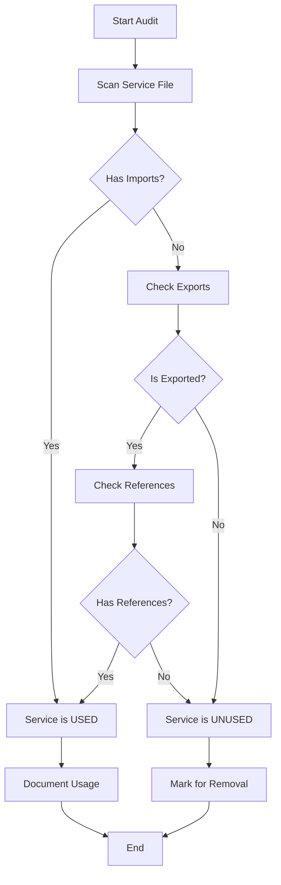

# Design Document - Code Quality Improvements

## Overview

This design document outlines the technical approach for Phase 2 of the improvement roadmap: Code Quality Improvements. The goal is to systematically eliminate TypeScript errors, improve type safety, audit unused code, expand test coverage, and establish a maintainable codebase foundation.

## Architecture

### High-Level Approach

```
┌─────────────────────────────────────────────────────────────┐
│                   Code Quality Improvements                  │
├─────────────────────────────────────────────────────────────┤
│                                                               │
│  ┌──────────────┐  ┌──────────────┐  ┌──────────────┐      │
│  │   Frontend   │  │   Backend    │  │    Tests     │      │
│  │  Type Fixes  │  │ Type Safety  │  │   Coverage   │      │
│  └──────────────┘  └──────────────┘  └──────────────┘      │
│         │                  │                  │              │
│         └──────────────────┴──────────────────┘              │
│                            │                                 │
│                   ┌────────▼────────┐                        │
│                   │  Documentation  │                        │
│                   │   & Cleanup     │                        │
│                   └─────────────────┘                        │
└─────────────────────────────────────────────────────────────┘
```

### Design Principles

1. **Incremental Changes** - Fix one component at a time, test, commit
2. **Type Safety First** - Establish proper types before fixing implementations
3. **Test-Driven** - Write tests before fixing complex issues
4. **Documentation** - Document as we go, not after
5. **No Breaking Changes** - Maintain backward compatibility

## Components and Interfaces

### 1. Type System Architecture

#### Shared Type Definitions

**Location:** `shared/types.ts` (new file)

```typescript
// User Session Type
export interface UserSession {
  id: number;
  email: string;
  plan: string;
  jti: string; // JWT token ID
}

// API Response Types
export interface ApiResponse<T = any> {
  success: boolean;
  data?: T;
  error?: string;
  message?: string;
  code?: string;
  timestamp: string;
  requestId?: string;
}

// Pagination Types
export interface PaginationParams {
  limit: number;
  offset: number;
  page: number;
}

export interface PaginatedResponse<T> extends ApiResponse<T[]> {
  pagination: {
    total: number;
    page: number;
    limit: number;
    hasNext: boolean;
    hasPrev: boolean;
  };
}
```

#### Frontend Type Definitions

**Location:** `client/src/types/` (new directory)

```typescript
// client/src/types/collaboration.ts
export interface ChatMessage {
  userId: number;
  userName: string;
  message: string;
  timestamp: string;
  type: 'message' | 'system' | 'notification';
  metadata?: Record<string, any>;
}

// client/src/types/user.ts
export interface UserProfile {
  id: number;
  email: string;
  firstName?: string;
  lastName?: string;
  plan: 'free' | 'pro' | 'enterprise';
  avatar?: string;
}

// client/src/types/analytics.ts
export interface TreemapData {
  name: string;
  value: number;
  growth: number;
  children?: TreemapData[];
}

export interface TreemapCellProps {
  x: number;
  y: number;
  width: number;
  height: number;
  name: string;
  value: number;
  growth: number;
}
```

### 2. Frontend Component Fixes

#### CollaborationChat.tsx Fix

**Problem:** Message type missing 'type' property

**Solution:**
```typescript
// Before
interface Message {
  userId: number;
  userName: string;
  message: string;
  timestamp: string;
}

// After
import { ChatMessage } from '@/types/collaboration';

// Use ChatMessage type throughout component
const [messages, setMessages] = useState<ChatMessage[]>([]);
```

#### layout-new.tsx Fix

**Problem:** User object has empty type

**Solution:**
```typescript
// Before
const user = useUser(); // Returns {}

// After
import { UserProfile } from '@/types/user';

const user = useUser() as UserProfile | null;

// Add proper null checks
{user?.plan === 'pro' && <ProFeature />}
{user?.firstName || user?.email}
```

#### analytics-dashboard.tsx Fix

**Problem:** Implicit 'any' types in Treemap component

**Solution:**
```typescript
// Before
content={({ x, y, width, height, name, value, growth }) => (
  <CustomCell ... />
)}

// After
import { TreemapCellProps } from '@/types/analytics';

content={(props: TreemapCellProps) => (
  <CustomCell {...props} />
)}
```

### 3. Service Audit System

#### Service Audit Process



#### Service Documentation Template

**Location:** `docs/SERVICES.md`

```markdown
# Service Documentation

## Active Services

### Perplexity Service
**File:** `server/services/perplexity.ts`
**Status:** ACTIVE
**Purpose:** Real-time market research and trend analysis
**Used By:** 
- `server/routes/search.ts` - Market gap analysis
- `server/services/gemini.ts` - Fallback for AI analysis

**API:**
```typescript
async function searchPerplexity(query: string): Promise<SearchResult[]>
```

**Dependencies:**
- `PERPLEXITY_API_KEY` environment variable
- `axios` for HTTP requests

**Usage Example:**
```typescript
import { searchPerplexity } from './services/perplexity';
const results = await searchPerplexity('AI market gaps');
```
```

### 4. Test Coverage Strategy

#### Test Organization

```
server/
├── __tests__/
│   ├── unit/
│   │   ├── services/
│   │   ├── middleware/
│   │   └── utils/
│   ├── integration/
│   │   ├── auth.test.ts
│   │   ├── search.test.ts
│   │   └── api.test.ts
│   └── e2e/
│       └── user-flows.test.ts
```

#### Test Patterns

**Unit Test Example:**
```typescript
// server/__tests__/unit/middleware/jwtAuth.test.ts
import { describe, it, expect, vi } from 'vitest';
import { jwtAuth } from '@/middleware/jwtAuth';

describe('JWT Authentication Middleware', () => {
  it('should attach user to request when token is valid', async () => {
    // Arrange
    const mockReq = {
      headers: { authorization: 'Bearer valid-token' }
    };
    const mockRes = {};
    const mockNext = vi.fn();
    
    // Act
    await jwtAuth(mockReq, mockRes, mockNext);
    
    // Assert
    expect(mockReq.user).toBeDefined();
    expect(mockNext).toHaveBeenCalled();
  });
});
```

**Integration Test Example:**
```typescript
// server/__tests__/integration/auth.test.ts
import { describe, it, expect } from 'vitest';
import request from 'supertest';
import { app } from '@/index';

describe('Authentication Flow', () => {
  it('should complete full auth cycle', async () => {
    // Register
    const registerRes = await request(app)
      .post('/api/auth/register')
      .send({ email: 'test@example.com', password: 'Test123!@#' });
    
    expect(registerRes.status).toBe(201);
    
    // Login
    const loginRes = await request(app)
      .post('/api/auth/login')
      .send({ email: 'test@example.com', password: 'Test123!@#' });
    
    expect(loginRes.status).toBe(200);
    expect(loginRes.body.accessToken).toBeDefined();
    
    // Access protected route
    const protectedRes = await request(app)
      .get('/api/user/profile')
      .set('Authorization', `Bearer ${loginRes.body.accessToken}`);
    
    expect(protectedRes.status).toBe(200);
  });
});
```

### 5. Middleware Fixes

#### httpsEnforcement.ts Async Chain Fix

**Problem:** Async functions not properly awaited in callback chains

**Solution:**
```typescript
// Before
private detectSessionHijacking(req: Request, session: any): void {
  if (condition) {
    await securityLogger.logSecurityEvent(...); // Error: await in non-async
  }
}

// After
private async detectSessionHijacking(req: Request, session: any): Promise<void> {
  if (condition) {
    await securityLogger.logSecurityEvent(...); // Correct
  }
}

// Update caller
private async enhanceSessionSecurity(req: Request, res: Response): Promise<void> {
  await this.detectSessionHijacking(req, session); // Await the async call
}
```

#### Security Logger Call Signature Fix

**Problem:** Incorrect parameters passed to logSecurityEvent

**Solution:**
```typescript
// Before
securityLogger.logSecurityEvent({
  type: 'SESSION_IP_CHANGE',
  userId: session.userId,
  ip: currentIP,
  // ...
});

// After
await securityLogger.logSecurityEvent(
  'SUSPICIOUS_LOGIN',           // eventType
  'session_ip_change',          // action
  true,                         // success
  {                             // context
    userId: session.userId,
    ipAddress: currentIP,
    userAgent: currentUserAgent,
    metadata: { /* ... */ }
  },
  undefined                     // errorMessage (optional)
);
```

## Data Models

### Type Hierarchy

```
User (from database)
  ↓
UserSession (for JWT/auth)
  ↓
UserProfile (for frontend)
```

### Type Conversion Flow

```typescript
// Database → Session
function userToSession(user: User): UserSession {
  return {
    id: user.id,
    email: user.email,
    plan: user.plan,
    jti: generateJTI()
  };
}

// Session → Profile
function sessionToProfile(session: UserSession, user: User): UserProfile {
  return {
    id: session.id,
    email: session.email,
    firstName: user.firstName,
    lastName: user.lastName,
    plan: session.plan as 'free' | 'pro' | 'enterprise',
    avatar: user.avatar
  };
}
```

## Error Handling

### Type Error Resolution Strategy

1. **Identify Root Cause** - Use `tsc --noEmit` to see all errors
2. **Fix Types First** - Define proper interfaces before fixing code
3. **Update Imports** - Ensure all files import from shared types
4. **Validate** - Run type checker after each fix
5. **Test** - Ensure runtime behavior unchanged

### Error Categories

| Category | Priority | Approach |
|----------|----------|----------|
| Missing types | High | Define in shared/types.ts |
| Implicit any | High | Add explicit types |
| Type mismatch | Medium | Fix at source |
| Null safety | Medium | Add null checks |
| Generic issues | Low | Add type parameters |

## Testing Strategy

### Coverage Goals

| Component | Target | Current | Gap |
|-----------|--------|---------|-----|
| Auth Services | 80% | ~60% | +20% |
| Middleware | 75% | ~40% | +35% |
| API Routes | 70% | ~30% | +40% |
| Services | 70% | ~50% | +20% |
| **Overall** | **70%** | **~45%** | **+25%** |

### Test Priorities

1. **Critical Path** (Must have 90%+ coverage)
   - Authentication flow
   - Authorization checks
   - Payment processing
   - Data validation

2. **Important** (Must have 70%+ coverage)
   - Search functionality
   - User management
   - Session handling
   - Error handling

3. **Nice to Have** (Target 50%+ coverage)
   - Analytics
   - Collaboration features
   - Export functionality

## Performance Considerations

### Type Checking Performance

- Use `skipLibCheck: true` in tsconfig.json for faster builds
- Implement incremental compilation
- Use project references for large codebases

### Test Performance

- Run unit tests in parallel
- Use test.concurrent for independent tests
- Mock external services
- Use in-memory database for integration tests

## Security Considerations

### Type Safety as Security

- Prevent injection attacks through strict typing
- Validate all user inputs with Zod schemas
- Use branded types for sensitive data
- Implement type guards for runtime validation

### Test Security

- Never commit real credentials in tests
- Use environment-specific test data
- Sanitize logs in test output
- Secure test database access

## Deployment Strategy

### Rollout Plan

1. **Phase 2.1: Frontend Fixes** (Day 1)
   - Fix TypeScript errors
   - Update component types
   - Test in development

2. **Phase 2.2: Service Audit** (Day 1-2)
   - Audit all services
   - Remove unused code
   - Update documentation

3. **Phase 2.3: Type Safety** (Day 2)
   - Create shared types
   - Update middleware
   - Fix async chains

4. **Phase 2.4: Testing** (Day 2-3)
   - Write missing tests
   - Achieve coverage goals
   - Fix failing tests

5. **Phase 2.5: Documentation** (Day 3)
   - Update all docs
   - Create SERVICES.md
   - Update CONTRIBUTING.md

### Validation Checklist

- [ ] All TypeScript errors resolved
- [ ] Test coverage >70%
- [ ] All tests passing
- [ ] Documentation complete
- [ ] No breaking changes
- [ ] Performance maintained
- [ ] Security validated

## Monitoring and Metrics

### Success Metrics

```typescript
interface QualityMetrics {
  typeScriptErrors: number;        // Target: 0
  testCoverage: number;            // Target: >70%
  buildTime: number;               // Target: <30s
  testRunTime: number;             // Target: <60s
  codeSmells: number;              // Target: <10
  technicalDebt: number;           // Target: <5 days
}
```

### Monitoring Tools

- **TypeScript Compiler** - Error tracking
- **Vitest** - Test coverage reports
- **ESLint** - Code quality metrics
- **GitHub Actions** - CI/CD validation

## Rollback Plan

### If Issues Arise

1. **Immediate Rollback**
   - Revert last commit
   - Run full test suite
   - Verify application works

2. **Partial Rollback**
   - Keep type definitions
   - Revert implementation changes
   - Fix issues incrementally

3. **Communication**
   - Document what went wrong
   - Update team on status
   - Plan remediation

## Future Considerations

### Post-Phase 2

- Implement strict mode in tsconfig.json
- Add pre-commit hooks for type checking
- Set up automated coverage reporting
- Implement code review checklist
- Consider migrating to stricter linting rules

### Technical Debt

Items to address in future phases:
- Migrate from any remaining 'any' types
- Implement branded types for IDs
- Add runtime type validation with Zod
- Improve error messages
- Add performance monitoring

## Conclusion

This design provides a systematic approach to improving code quality through:
- Clear type definitions and hierarchy
- Comprehensive testing strategy
- Service audit and cleanup process
- Proper error handling
- Documentation standards

The implementation will be done incrementally with continuous validation to ensure no breaking changes and maintain system stability.

---

**Next Step:** Create tasks.md with specific implementation tasks
