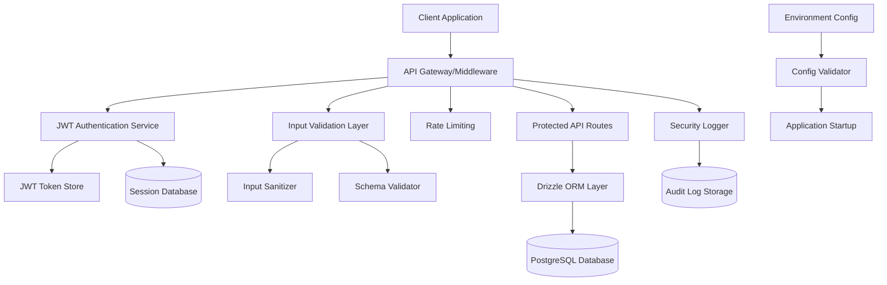
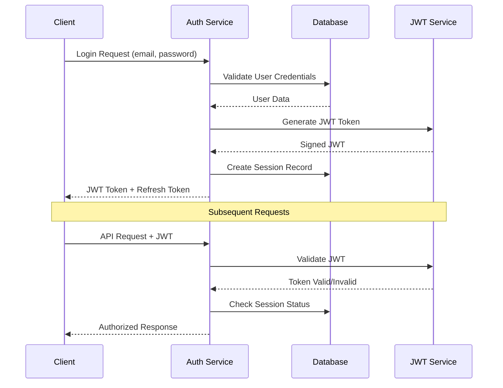

# Security Hardening Design Document

## Overview

This design document outlines the comprehensive security hardening implementation for the application, addressing critical vulnerabilities including authentication bypasses, SQL injection risks, environment validation gaps, and hardcoded credentials. The solution implements industry-standard security practices while maintaining backward compatibility and user experience.

The security hardening transforms the current demo-level authentication into a production-ready JWT-based system with proper session management, comprehensive input validation, secure error handling, and robust logging capabilities.

## Architecture

### Security Architecture Components



### Authentication Flow



## Components and Interfaces

### 1. JWT Authentication Service

**Interface: `IJWTAuthService`**
```typescript
interface IJWTAuthService {
  generateTokens(user: User): Promise<TokenPair>;
  validateToken(token: string): Promise<JWTPayload | null>;
  refreshToken(refreshToken: string): Promise<TokenPair | null>;
  revokeToken(token: string): Promise<void>;
  blacklistToken(token: string): Promise<void>;
}

interface TokenPair {
  accessToken: string;
  refreshToken: string;
  expiresIn: number;
}

interface JWTPayload {
  sub: string; // user ID
  email: string;
  role: string;
  iat: number;
  exp: number;
  jti: string; // JWT ID for revocation
}
```

**Implementation Details:**
- Uses RS256 algorithm with public/private key pairs
- Access tokens expire in 15 minutes
- Refresh tokens expire in 7 days
- Implements token blacklisting for logout
- Includes rate limiting for token generation

### 2. Secure Database Layer

**Interface: `ISecureRepository`**
```typescript
interface ISecureRepository<T> {
  findById(id: number, userId: string): Promise<T | null>;
  create(data: Partial<T>, userId: string): Promise<T>;
  update(id: number, data: Partial<T>, userId: string): Promise<T | null>;
  delete(id: number, userId: string): Promise<boolean>;
  findByUser(userId: string, filters?: QueryFilters): Promise<T[]>;
}

interface QueryFilters {
  limit?: number;
  offset?: number;
  sortBy?: string;
  sortOrder?: 'asc' | 'desc';
  where?: Record<string, any>;
}
```

**Security Features:**
- All queries use Drizzle ORM parameterized queries
- Row-level security through user ID validation
- Input sanitization before database operations
- Query result filtering to prevent data leakage
- Audit logging for all database operations

### 3. Environment Configuration Validator

**Interface: `IConfigValidator`**
```typescript
interface IConfigValidator {
  validateRequired(): ValidationResult;
  validateOptional(): ValidationResult;
  getSecureConfig(): SecureConfig;
  maskSensitiveValues(config: any): any;
}

interface ValidationResult {
  isValid: boolean;
  errors: ConfigError[];
  warnings: ConfigWarning[];
}

interface SecureConfig {
  jwt: JWTConfig;
  database: DatabaseConfig;
  services: ServiceConfig;
  security: SecurityConfig;
}
```

**Validation Rules:**
- JWT_SECRET must be at least 32 characters
- Database connection string must be valid
- API keys validated for format and accessibility
- Security headers configuration validated
- Rate limiting configuration validated

### 4. Secure Error Handler

**Interface: `ISecureErrorHandler`**
```typescript
interface ISecureErrorHandler {
  handleError(error: Error, context: ErrorContext): ErrorResponse;
  logSecurityEvent(event: SecurityEvent): void;
  sanitizeError(error: Error): SafeError;
}

interface ErrorResponse {
  message: string;
  code: string;
  statusCode: number;
  timestamp: string;
  requestId: string;
}

interface SecurityEvent {
  type: 'AUTH_FAILURE' | 'SQL_INJECTION_ATTEMPT' | 'RATE_LIMIT_EXCEEDED';
  userId?: string;
  ip: string;
  userAgent: string;
  details: Record<string, any>;
}
```

## Data Models

### Enhanced User Model
```typescript
interface SecureUser extends User {
  // Security fields
  passwordHash: string;
  salt: string;
  failedLoginAttempts: number;
  lastFailedLogin: Date | null;
  accountLocked: boolean;
  lockoutExpires: Date | null;
  
  // Session management
  activeSessions: string[]; // JWT IDs
  lastLogin: Date | null;
  lastPasswordChange: Date;
  
  // Security preferences
  twoFactorEnabled: boolean;
  securityQuestions: SecurityQuestion[];
  
  // Audit fields
  createdBy: string;
  updatedBy: string;
  securityEvents: SecurityEvent[];
}
```

### JWT Token Model
```typescript
interface JWTToken {
  id: string; // JWT ID (jti)
  userId: string;
  tokenType: 'access' | 'refresh';
  issuedAt: Date;
  expiresAt: Date;
  isRevoked: boolean;
  revokedAt: Date | null;
  revokedBy: string | null;
  deviceInfo: DeviceInfo;
  ipAddress: string;
}
```

### Security Audit Log Model
```typescript
interface SecurityAuditLog {
  id: string;
  timestamp: Date;
  userId: string | null;
  action: string;
  resource: string;
  resourceId: string | null;
  ipAddress: string;
  userAgent: string;
  success: boolean;
  errorMessage: string | null;
  metadata: Record<string, any>;
}
```

## Error Handling

### Error Classification System

**Security Error Types:**
1. **Authentication Errors** - Invalid credentials, expired tokens
2. **Authorization Errors** - Insufficient permissions, resource access denied
3. **Input Validation Errors** - Malformed data, injection attempts
4. **Rate Limiting Errors** - Too many requests, suspicious activity
5. **System Errors** - Database failures, service unavailable

**Error Response Strategy:**
- Generic error messages for security-sensitive failures
- Detailed logging internally with full context
- Rate limiting on error responses to prevent enumeration
- Correlation IDs for tracking across services

### Error Sanitization Rules

```typescript
const ERROR_SANITIZATION_RULES = {
  // Never expose these in client responses
  SENSITIVE_PATTERNS: [
    /password/i,
    /secret/i,
    /key/i,
    /token/i,
    /hash/i,
    /salt/i,
    /connection string/i,
    /database/i
  ],
  
  // Generic replacements for common errors
  GENERIC_MESSAGES: {
    'Invalid credentials': 'Authentication failed',
    'User not found': 'Authentication failed',
    'Password incorrect': 'Authentication failed',
    'Account locked': 'Account temporarily unavailable',
    'Token expired': 'Session expired, please login again'
  }
};
```

## Testing Strategy

### Security Testing Approach

**1. Authentication Testing**
- JWT token validation and expiration
- Session management and cleanup
- Password hashing and verification
- Account lockout mechanisms
- Token blacklisting functionality

**2. Authorization Testing**
- Role-based access control
- Resource-level permissions
- Cross-user data access prevention
- Administrative function protection

**3. Input Validation Testing**
- SQL injection prevention
- XSS protection
- Parameter tampering
- File upload security
- JSON payload validation

**4. Infrastructure Testing**
- Environment variable validation
- Configuration security
- Rate limiting effectiveness
- Error handling security
- Logging and monitoring

### Test Implementation Strategy

**Unit Tests:**
- Individual security functions
- Input validation routines
- Error handling logic
- Configuration validation

**Integration Tests:**
- End-to-end authentication flows
- Database security measures
- API endpoint protection
- Cross-service communication security

**Security Tests:**
- Penetration testing scenarios
- Vulnerability scanning
- Load testing with malicious payloads
- Session management testing

### Automated Security Scanning

**Static Analysis:**
- Code scanning for security vulnerabilities
- Dependency vulnerability checking
- Configuration security validation
- Secret detection in codebase

**Dynamic Analysis:**
- Runtime security monitoring
- API security testing
- Authentication flow testing
- Input validation testing

## Implementation Phases

### Phase 1: Core Security Infrastructure (Week 1)
- JWT authentication service implementation
- Environment configuration validation
- Basic error handling standardization
- Security logging framework

### Phase 2: Database Security (Week 1-2)
- Replace all raw SQL with Drizzle ORM
- Implement parameterized queries
- Add input validation middleware
- Database audit logging

### Phase 3: Advanced Security Features (Week 2)
- Session management and cleanup
- Rate limiting implementation
- Advanced error handling
- Security monitoring dashboard

### Phase 4: Testing and Validation (Week 2-3)
- Comprehensive security testing
- Penetration testing
- Performance impact assessment
- Documentation and training

## Security Monitoring and Alerting

### Real-time Security Monitoring

**Metrics to Track:**
- Failed authentication attempts
- Suspicious API access patterns
- Rate limiting triggers
- Error rate spikes
- Database query anomalies

**Alert Conditions:**
- Multiple failed logins from same IP
- SQL injection attempt patterns
- Unusual data access patterns
- System configuration changes
- Security policy violations

### Audit Trail Requirements

**Logged Events:**
- All authentication events (success/failure)
- Administrative actions
- Data access and modifications
- Configuration changes
- Security policy violations

**Log Retention:**
- Security logs: 2 years minimum
- Audit logs: 7 years for compliance
- Performance logs: 90 days
- Debug logs: 30 days

This design provides a comprehensive security foundation that addresses all identified vulnerabilities while maintaining system performance and user experience. The modular approach allows for incremental implementation and testing of each security component.